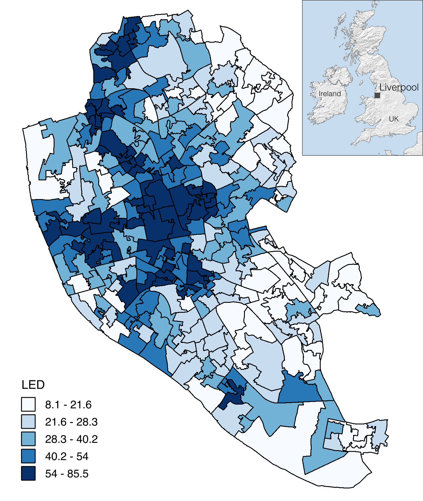

# Description of Data

## General information

* **Location**: Liverpool local authority, England.
* **Format**: Spatial database, GIS vector layer.
* **Spatial Unit of Analysis**: Lower Layer Super Output Area (LSOA).
* **Coordinate System**: EPSG 27700 OSGB 1936 British National Grid.
* **Format**: GeoJson vector file.
* **Geometry**: Polygon.
* **Number of features**: 298.

Data used in this research corresponds to a polygon GeoJson file
composed of 298 contiguous Lower Layer Super Output Areas (LSOA) of
Liverpool, England (Figure 1).

Figure 1. Living
deprivation index (for 2015) at LSOA level in Liverpool.

## Attributes

### The English Indices of Deprivation

The Living Environment Deprivation index is one of the seven dimensions
that compose the English Indices of Deprivation, which includes income;
employment; health and disability; education, skills and training;
crime; barriers to housing and services; and living environment.
According to (Smith et al., 2015), the model of multiple deprivation is
based on the idea that (1) the separate dimensions of deprivation can be
recognized and measured separately, (2) these dimensions of deprivation
are experienced by individuals living in an area, and (3) an area-level
measure of deprivation for each of the dimensions can be calculated
(Smith et al., 2015).

Although the paper uses only one index (LED index), the GIS layer
contains all the indices of (Smith et al., 2015). For a full description
of these indices, see

> [https://www.gov.uk/government/uploads/system/uploads/attachment_data/file/464485/English_Indices_of_Deprivation_2015_-_Technical-Report.pdf](https://www.gov.uk/government/uploads/system/uploads/attachment_data/file/464485/English_Indices_of_Deprivation_2015_-_Technical-Report.pdf)

Table 1. English indices of deprivation variables.

  **Variable name** | **Description**
  ----------------- | -------------------------------------------------------------------------
  `imd\_rank`       | Rank according the Index of Multiple Deprivation
  `imd\_score`      | Score of the Index of Multiple Deprivation
  `income`          | Score of the Income Deprivation domain of the IMD
  `employment`      | Score of the Employment Deprivation domain of the IMD
  `education`       | Score of the Education, Skills & Training Deprivation domain of the IMD
  `health`          | Score of the Health Deprivation & Disability domain of the IMD
  `crime`           | Score of the Crime domain of the IMD
  `housing`         | Score of the Barriers to Housing & Services domain of the IMD
  `living-env`      | Score of the Living Environment Deprivation domain of the IMD
  `idaci`           | Score of the Income Deprivation Affecting Children Index
  `idaopi`          | Score of the Income Deprivation Affecting Older People Index

### Remote sensing derived variables

We processed a satellite image of Liverpool city downloaded in February
2016 from the Google Satellite Map web service with enough zoom level to
be similar to VHR imagery with sub-meter pixel size using a tool for
automatic downloading of image tiles (<http://www.allallsoft.com/gsmd>);
we then combined them into a single mosaic in geographic coordinates.
According to the data provider information, displayed in Google Earth,
and the Google Earth blog, these Liverpool VHR imagery were collected by
Google itself in 4th April 2015. We projected the image mosaic onto the
same coordinate system of the spatial database of deprivation indices of
Liverpool and obtained a georeferenced image with a pixel size of 70 cm.
We used that image as an input to calculate image-derived features or
variables for the same spatial units for which the LED index is reported
(LSOA).

A per-pixel classification of the scene was performed to calculate a set of land-cover variables within LSOA polygons. Next, we used an automatic tool for image feature extraction at the object level called FETEX 2.0 (Ruiz, Recio, Fernández-Sarría, & Hermosilla, 2011) to extract spectral, texture and structure features at the LSOA level (Table 3). FETEX 2.0 is available at the Geo-Environmental Cartography and Remote Sensing Group website (at Universitat Politècnica de València):

> [http://cgat.webs.upv.es/software/](http://cgat.webs.upv.es/software/)

#### Land cover variables

We used the red, green and blue bands of the GE image as inputs to a supervised per-pixel classification in ENVI software using a maximum likelihood classifier. The classification accuracy was assessed using a point-based technique with a reference dataset of randomly selected points. We collected a sample of on-screen ground truth points and divided it randomly into two datasets: 80% as the classification training set and 20% as the validation set. Table 2 shows the confusion matrix as well as the overall accuracy and the kappa coefficient of the classification results. The classified image at the pixel level was used to calculate the following aggregated land cover variables at the LSOA level: the percentage of impervious surfaces (gray and orange), the percentage of orange impervious surfaces, the percentage of impervious surfaces without orange surfaces, the fraction of orange surfaces over the impervious surfaces, the percentage of vegetation, the percentage of soil, the percentage of shadows, and the percentage of water.

Table 2. Accuracy assessment of GE image classification results.

For a full description of the image processing workflow, see: 

> [http://journals.plos.org/plosone/article?id=10.1371/journal.pone.0176684#sec002](http://journals.plos.org/plosone/article?id=10.1371/journal.pone.0176684#sec002)

#### Spectral variables

The spectral features are the summary statistics of pixel values inside objects; i.e., LSOA boundaries in this study case. These features complement the information provided by the land cover features, as they give a general measure of the color of the areas. We selected the mean and standard deviation in each RGB band for this exercise (R=1, G=2, B=3, variables MEAN1, DEVST1, MEAN2, DEVST2, MEAN3, and DEVST3 in Table 3).

#### Texture variables

Texture variables describe the spatial distribution of intensity values in an image and provide information on contrast, uniformity, roughness, etc. (Baraldi & Parmiggiani, 1995). The histogram of pixel values and the Grey Level Co-occurrence Matrix (GLCM) inside each polygon were used for texture feature extraction in FETEX 2.0. The histogram is used to compute the kurtosis and skewness features. The GLCM describes the co-occurrences of the pixel values that are separated at a distance of one pixel inside the polygon (Baraldi & Parmiggiani, 1995), and it is used to calculate a set of texture variables proposed by Haralick, Shanmugam, & Dinstein (1973) that are widely used in image processing: uniformity, entropy, contrast, inverse difference moment, covariance, variance, and correlation. The edgeness factor is a feature that represents the density of edges present in a neighborhood (Sutton & Hall, 1972), and FETEX also computes the mean and standard deviation of the edgeness factor within this set of texture features. These variables were calculated in FETEX with the LSOA polygons using the red band (1) of the GE image.

#### Structure variables

Structural variables characterize the spatial arrangement of elements within the polygons in terms of randomness or regularity of the distribution of the elements, and these data were computed in FETEX using the experimental semivariogram approach (Balaguer, Ruiz, Hermosilla, & Recio, 2010; Balaguer-Beser, Ruiz, Hermosilla, & Recio, 2013). The semivariogram is a suitable tool for the quantitative characterization of spatial patterns because it quantifies the spatial associations of the pixel intensity values and measures the degree of spatial correlation between different pixels in an image (Ruiz et al., 2011). Structural features are derived from a zonal analysis defined by a set of singular points on the semivariogram: the first maximum, first minimum, and second maximum. We used the red band (1) of the GE image with the LSOA polygons to calculate these variables in FETEX (for a full description of these features see Balaguer et al., 2010; Ruiz et al., 2011).

Table 3. Remote sensing-derived variables at LSOA level.

**References:**

Balaguer, A., Ruiz, L. A., Hermosilla, T., & Recio, J. A. (2010). Definition of a comprehensive set of texture semivariogram features and their evaluation for object-oriented image classification. Computers & Geosciences, 36(2), 231–240. doi:10.1016/j.cageo.2009.05.003

Balaguer-Beser, A., Ruiz, L. A., Hermosilla, T., & Recio, J. A. (2013). Using semivariogram indices to analyse heterogeneity in spatial patterns in remotely sensed images. Computers & Geosciences, 50, 115–127. doi:10.1016/j.cageo.2012.08.001

Baraldi, A., & Parmiggiani, F. (1995). An investigation of the textural characteristics associated with gray level cooccurrence matrix statistical parameters. IEEE Transactions on Geoscience and Remote Sensing, 33(2), 293–304. doi:10.1109/36.377929

Haralick, R. M., Shanmugam, K., & Dinstein, I. (1973). Textural features for image classification. IEEE Transactions on Systems, Man, and Cybernetics, SMC-3(6), 610–621.

Ruiz, L. A., Recio, J. A., Fernández-Sarría, A., & Hermosilla, T. (2011). A feature extraction software tool for agricultural object-based image analysis. Computers and Electronics in Agriculture, 76(2), 284–296. https://doi.org/10.1016/j.compag.2011.02.007

Smith, T., Noble, M., Noble, S., Wright, G., McLennan, D., & Plunkett, E. (2015). The English Indices of Deprivation 2015: Technical Report. London: Department of Communities and Local Government. Retrieved from https://www.gov.uk/government/uploads/system/uploads/attachment_data/file/464485/English_Indices_of_Deprivation_2015_-_Technical-Report.pdf

Sutton, R. N., & Hall, E. L. (1972). Texture Measures for Automatic Classification of Pulmonary Disease. IEEE Transactions on Computers, C-21(7), 667–676. doi:10.1109/T-C.1972.223572
